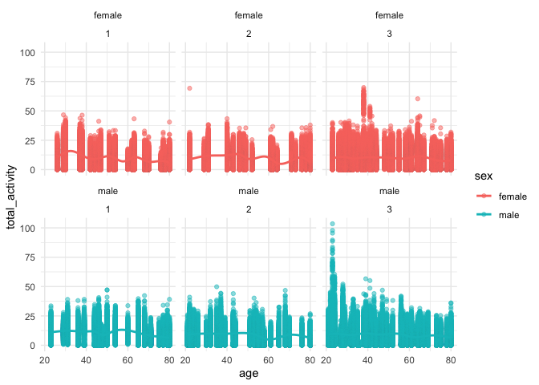
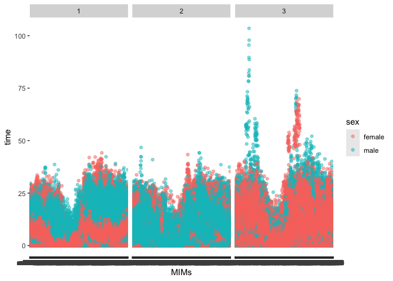
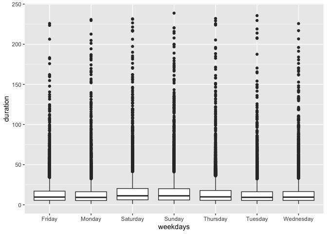
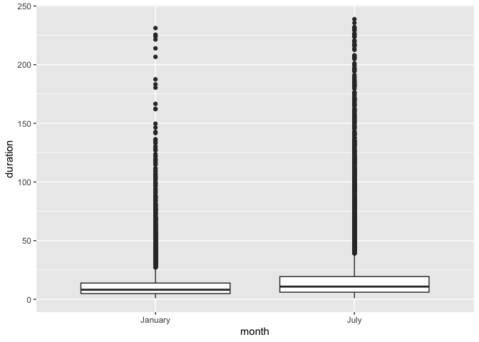
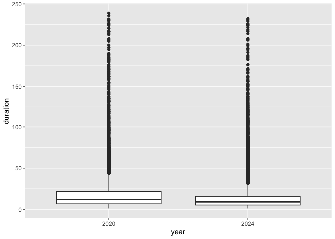
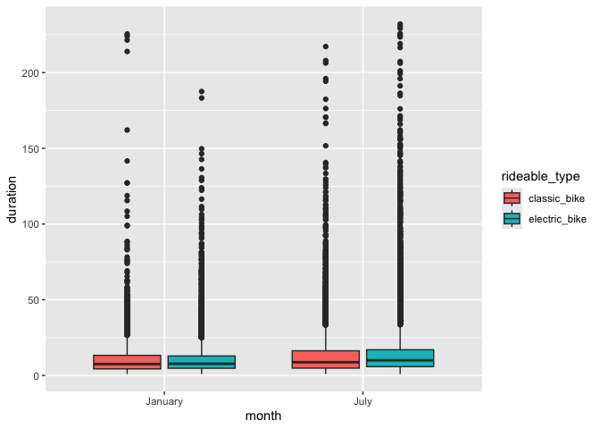
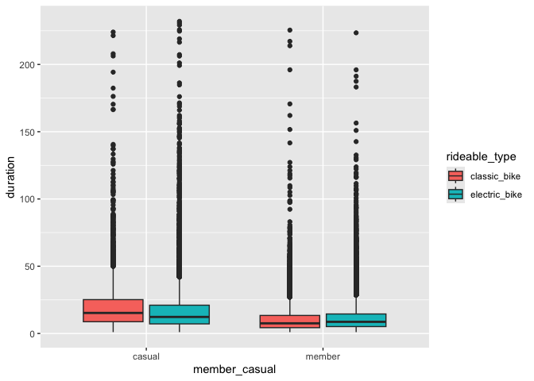

p8105_hw3_scs2267
================
2024-10-16

# Problem 1

``` r
library(p8105.datasets)
data("ny_noaa")

library(tidyverse)
```

    ## ── Attaching core tidyverse packages ──────────────────────── tidyverse 2.0.0 ──
    ## ✔ dplyr     1.1.4     ✔ readr     2.1.5
    ## ✔ forcats   1.0.0     ✔ stringr   1.5.1
    ## ✔ ggplot2   3.5.1     ✔ tibble    3.2.1
    ## ✔ lubridate 1.9.3     ✔ tidyr     1.3.1
    ## ✔ purrr     1.0.2     
    ## ── Conflicts ────────────────────────────────────────── tidyverse_conflicts() ──
    ## ✖ dplyr::filter() masks stats::filter()
    ## ✖ dplyr::lag()    masks stats::lag()
    ## ℹ Use the conflicted package (<http://conflicted.r-lib.org/>) to force all conflicts to become errors

``` r
weather_df = ny_noaa
```

This data frame contains information about precipitation, snowfall,
maximum temperature, and minimum temperature by date.

(Unfortunately I was unable to complete the rest of this section)

# Problem 2

``` r
demographic_df = read_csv("./data/demographic.csv", show_col_types = FALSE) %>% 
  janitor::clean_names() %>% 
  mutate(
     sex = 
      case_match(
        sex, 
        1 ~ "male", 
        2 ~ "female"),
    sex = as.factor(sex))
  

accel_df = read_csv("./data/nhanes_accel.csv", show_col_types = FALSE) %>% 
  janitor::clean_names() %>% 
  pivot_longer(
    min1:min1440,
    names_to = "MIMs",
    values_to = "time"
  )

mims_df = left_join(accel_df, demographic_df, by = "seqn") %>% 
  drop_na() %>% 
  filter(age>=21)
```

## MIMs by Sex for Each Education Category

### Table

``` r
sex_and_educ_df = group_by(mims_df, education, sex) %>% 
  summarize(observations = n())
```

    ## `summarise()` has grouped output by 'education'. You can override using the
    ## `.groups` argument.

``` r
sex_and_educ_df
```

    ## # A tibble: 6 × 3
    ## # Groups:   education [3]
    ##   education sex    observations
    ##       <dbl> <fct>         <int>
    ## 1         1 female        40320
    ## 2         1 male          38880
    ## 3         2 female        33120
    ## 4         2 male          50400
    ## 5         3 female        84960
    ## 6         3 male          80640

The highest frequency in this table are males and females in education
level 3. In education level 1, there appears to be a higher frequency of
females than males, and in education level 2, there appears to be a
higher frequency of males to females.

### Plot 1

``` r
mims_df %>% 
  group_by(seqn, sex, age, time, education) %>% 
  summarise(total_activity = sum(time)) %>% 
  ggplot(aes(x = age, y = total_activity, color = sex))+
  facet_wrap(sex~education)+
  geom_point(alpha = .5)+
  geom_smooth(se = FALSE)+
  theme_minimal()
```

    ## `summarise()` has grouped output by 'seqn', 'sex', 'age', 'time'. You can
    ## override using the `.groups` argument.
    ## `geom_smooth()` using method = 'gam' and formula = 'y ~ s(x, bs = "cs")'

<!-- -->
This plot indicates higher activity among young men and women in
education level three than the other education groups. Men and women
appear to have a similar distribution in the first two education groups,
but men appear to have higher variability in activity when they are
younger in the third education category.

### Plot 2

``` r
mims_df %>% 
  group_by(sex, MIMs,time, education) %>% 
  ggplot(aes(x = MIMs, y = time, color = sex))+
  facet_wrap(~education)+
  geom_point(alpha = .5)
```

<!-- -->
This table indicates that, among all education and sex groups, there
appears to one peak in activity earlier in the day, and another peak in
activity later in the day. Activity per minute appears to be equally
distributed between men and women in all education groups, however, in
education group 1, there appears to be higher variation in activity in
men towards the beginning of the day, and higher variation in activity
in women towards the end of the day.

# Problem 3

``` r
jan_2020_df = read_csv("./citibike/Jan 2020 Citi.csv.zip", show_col_types = FALSE) %>% 
  mutate(
    month = "January",
    year = "2020",
    month = as.factor(month),
    year = as.factor(year)
  )

july_2020_df = read_csv("./citibike/July 2020 Citi.csv.zip", show_col_types = FALSE) %>% 
  mutate(
    month = "July",
    year = "2020",
    month = as.factor(month),
    year = as.factor(year)
  )

jan_2024_df = read_csv("./citibike/Jan 2024 Citi.csv.zip", show_col_types = FALSE) %>% 
  mutate(
    month = "January",
    year = "2024",
    month = as.factor(month),
    year = as.factor(year)
    )

july_2024_df = read_csv("./citibike/July 2024 Citi.csv.zip", show_col_types = FALSE) %>% 
  mutate(
    month = "July",
    year = "2024",
    month = as.factor(month),
    year = as.factor(year)
    )

citibike_df = bind_rows(jan_2020_df, july_2020_df, jan_2024_df, july_2024_df) %>% 
  relocate(ride_id, year, month, member_casual) %>% 
  arrange(year, month)
```

## Table 1

``` r
member_table_df = group_by(citibike_df, year, month, member_casual) %>% 
  summarize(number_of_rides = n()) %>% 
  pivot_wider(
    names_from = "member_casual",
    values_from = "number_of_rides"
  ) %>% 
  arrange(year, month)
```

    ## `summarise()` has grouped output by 'year', 'month'. You can override using the
    ## `.groups` argument.

``` r
member_table_df
```

    ## # A tibble: 4 × 4
    ## # Groups:   year, month [4]
    ##   year  month   casual member
    ##   <fct> <fct>    <int>  <int>
    ## 1 2020  January    984  11436
    ## 2 2020  July      5637  15411
    ## 3 2024  January   2108  16753
    ## 4 2024  July     10894  36262

The highest number of both casual and member bikers was in July 2024,
and these numbers seem to increase significantly from January 2024. From
January 2020 to January 2024, the number of casual bikers appears to be
consistently significantly lower than the number of member bikers.

## Table 2

``` r
top_rides_df = group_by(citibike_df, year, month, start_station_name) %>% 
  summarize(number_of_rides = n()) %>% 
  mutate(ride_ranking = min_rank(number_of_rides)) %>% 
  filter(year == "2024", month == "July", min_rank(desc(number_of_rides)) < 6) %>% 
  select(start_station_name, number_of_rides) %>% 
  arrange(desc(number_of_rides))
```

    ## `summarise()` has grouped output by 'year', 'month'. You can override using the
    ## `.groups` argument.
    ## Adding missing grouping variables: `year`, `month`

``` r
top_rides_df
```

    ## # A tibble: 5 × 4
    ## # Groups:   year, month [1]
    ##   year  month start_station_name       number_of_rides
    ##   <fct> <fct> <chr>                              <int>
    ## 1 2024  July  Pier 61 at Chelsea Piers             163
    ## 2 2024  July  University Pl & E 14 St              155
    ## 3 2024  July  W 21 St & 6 Ave                      152
    ## 4 2024  July  West St & Chambers St                150
    ## 5 2024  July  W 31 St & 7 Ave                      146

## Plot 1

``` r
week = group_by(citibike_df, weekdays, duration) %>% 
  mutate(duration = median(duration)) %>%
  arrange(weekdays) %>% 
  ggplot(aes(x = weekdays, y = duration))+
  geom_boxplot()

week
```

<!-- -->

``` r
month = group_by(citibike_df, month, duration) %>% 
  mutate(duration = median(duration)) %>% 
  ggplot(aes(x = month, y = duration))+
  geom_boxplot()

month
```

<!-- -->

``` r
year = group_by(citibike_df, year, duration) %>% 
  mutate(duration = median(duration)) %>% 
  ggplot(aes(x = year, y = duration))+
  geom_boxplot()

year
```

<!-- -->

The median duration of cycling time appears to be slightly higher on the
weekends.The median duration by month appears to be much higher in July
than January. The median duration by year is higher in 2020 than in
2024.

## Plot 2

``` r
by_month = group_by(citibike_df, year, month, rideable_type, duration) %>% 
  filter(year == "2024") %>% 
  ggplot(aes(x = month, y = duration, fill = rideable_type))+
  geom_boxplot()

by_month
```

<!-- -->

``` r
by_membership = group_by(citibike_df, year, member_casual, rideable_type, duration) %>% 
  filter(year == "2024") %>% 
  ggplot(aes(x = member_casual, y = duration, fill = rideable_type))+
  geom_boxplot()

by_membership
```

<!-- -->
The ride duration by month was highest with electric bikes in July.
However, there does not appear to be a noticeable difference between the
ride durations for the classic and electric bikes in January. Ride
duration was highest for casual bikers who used a classic bike, and
there was not a significant difference among member bikers between using
a classic or electric bike.
